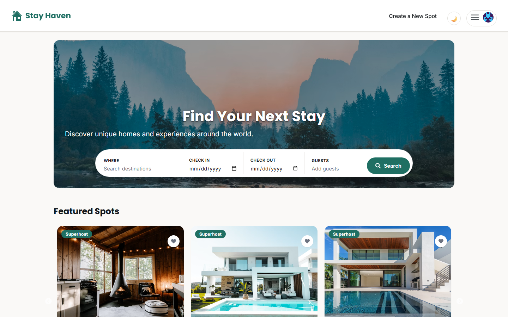
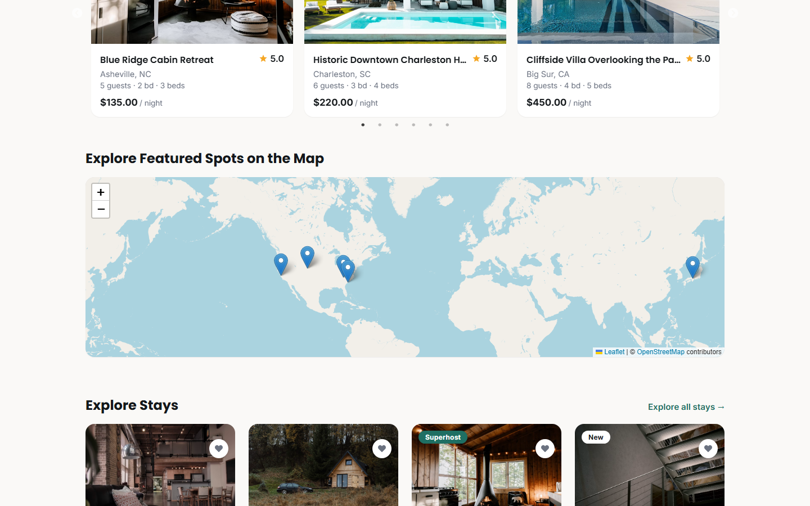
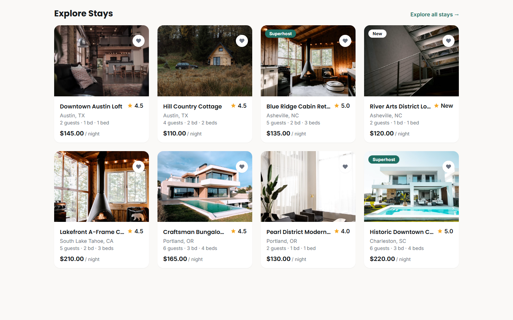
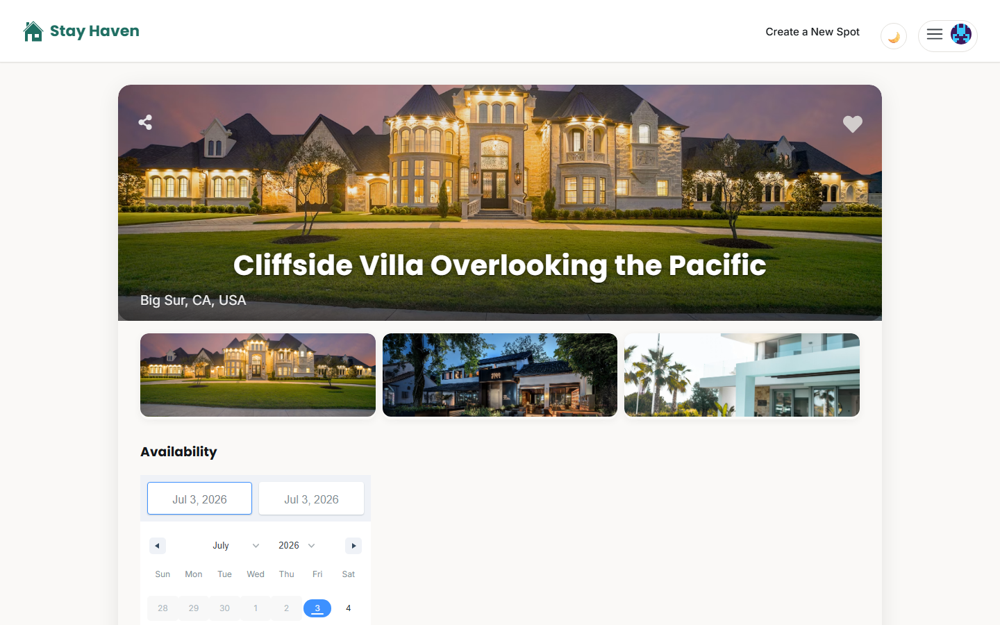
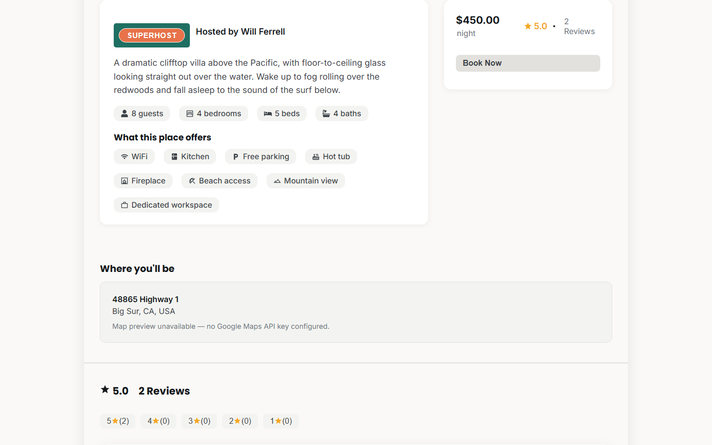
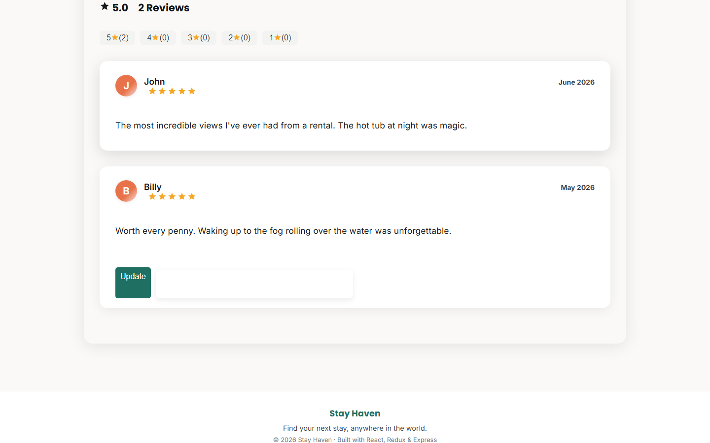
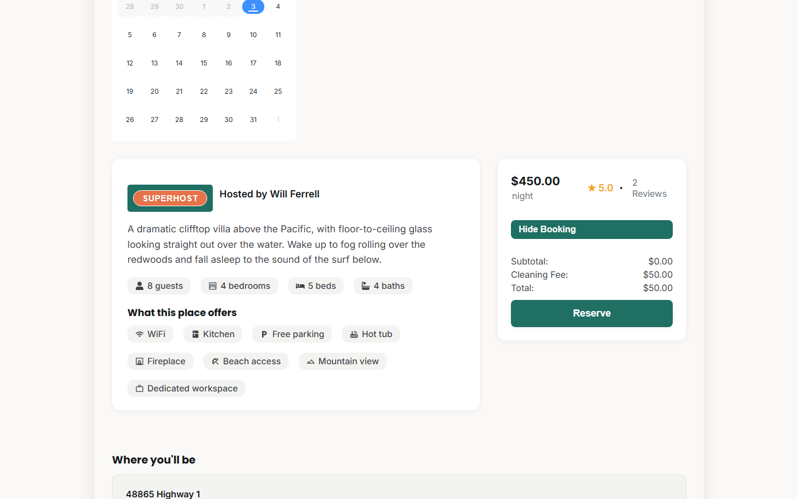
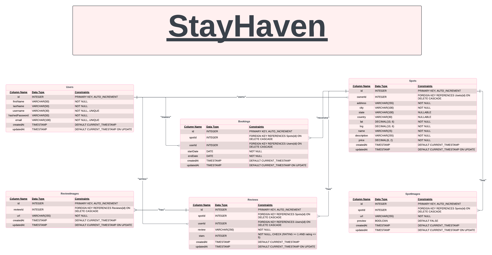

# StayHaven

[Live Site](https://stayhaven-hyyh.onrender.com)

StayHaven is a full-stack Airbnb-style booking platform where users can browse, book, and review unique stays around the world. Built with React, Redux, Express, Sequelize, and PostgreSQL.

---

## Table of Contents

-   [Features](#features)
-   [Screenshots](#screenshots)
-   [Tech Stack](#tech-stack)
-   [Getting Started](#getting-started)
    -   [Prerequisites](#prerequisites)
    -   [Installation](#installation)
    -   [Environment Variables](#environment-variables)
    -   [Database Setup](#database-setup)
    -   [Running the App](#running-the-app)
-   [Project Structure](#project-structure)
-   [API Documentation](#api-documentation)
-   [Database Schema](#database-schema)
-   [Contributing](#contributing)
-   [Contact](#contact)

---

## Features

-   User authentication (sign up, login, logout)
-   Real search by location, guest count, and date availability, with a dedicated shareable results page
-   Browse ~26 realistic listings (apartments, houses, cabins, lofts, villas, cottages) across 18 cities worldwide
-   View detailed spot pages with image galleries, amenities, and an interactive map
-   Book spots with date selection and a live availability calendar
-   Leave reviews and ratings for spots
-   Manage your own spots, bookings, and reviews
-   Wishlist spots and view them on a dedicated Wishlist page
-   View upcoming and past bookings on a dedicated My Trips page, with cancellation
-   Site-wide dark mode
-   Responsive and accessible UI

---

## Screenshots

> **Note:** The screenshots below predate the visual redesign (new design system, realistic listings, redone search/booking/wishlist/trips flows) and need to be retaken against the current UI.


[]
[]

[]
[]



---

## Tech Stack

-   **Frontend:** React, Redux, Vite, Framer Motion, React Date Range, Leaflet, Google Maps API
-   **Backend:** Node.js, Express, Sequelize (SQLite in development, PostgreSQL in production)
-   **Authentication:** JWT, bcrypt
-   **Deployment:** Render.com

---

## Getting Started

### Prerequisites

-   [Node.js](https://nodejs.org/) (v20+ recommended)
-   [npm](https://www.npmjs.com/)
-   PostgreSQL is only required in production — local development uses a file-based SQLite database, no separate install needed.

### Installation

1. **Clone the repository:**

    ```sh
    git clone https://github.com/BMcCarthy96/StayHaven.git
    cd StayHaven
    ```

2. **Install dependencies:**
    ```sh
    npm install
    cd backend && npm install
    cd ../frontend && npm install
    ```

### Environment Variables

Copy `backend/.env.example` to `backend/.env` and fill in your own values:

```
NODE_ENV=development
PORT=8000
JWT_SECRET=your_jwt_secret
JWT_EXPIRES_IN=604800
SCHEMA=dbSchema
DB_FILE=./db/dev.db
```

Copy `frontend/.env.example` to `frontend/.env`:

```
VITE_GOOGLE_MAPS_API_KEY=your_google_maps_api_key_here
```

Get a key from the [Google Cloud Console](https://console.cloud.google.com/google/maps-apis) (enable the Maps JavaScript API, and restrict the key to your domain). Without this key, the app still runs fully — the spot details page falls back to a static address block instead of an interactive map.

For production, configure both sets of environment variables on Render or your hosting provider. Since Vite bakes `VITE_*` variables in at build time, `VITE_GOOGLE_MAPS_API_KEY` must be set as a **build-time** environment variable, not just a runtime one.

### Database Setup

1. **Create the database and schema:**

    ```sh
    createdb stayhaven_dev
    ```

2. **Run migrations and seeders:**
    ```sh
    npx sequelize-cli db:migrate
    npx sequelize-cli db:seed:all
    ```

### Running the App

**Development:**

-   **Backend:**
    ```sh
    cd backend
    npm start
    ```
-   **Frontend:**
    ```sh
    cd frontend
    npm run dev
    ```

**Production Build:**

-   From the repo root, this builds the frontend and prepares the backend:
    ```sh
    npm run build
    npm start
    ```
    The backend serves the built frontend from `frontend/dist` in production. `frontend/dist` is not committed to the repo — it's built fresh on every deploy, so Render's build command must be `npm run build` at the repo root (not just the backend's).

### Demo Account

To explore the app without signing up, log in with:

-   **Username:** `Demo-lition`
-   **Password:** `password`

(Also available as a one-click "Continue as demo user" link on the login form.)

---

## Project Structure

```
StayHaven/
├── backend/
│   ├── app.js
│   ├── config/
│   ├── db/
│   │   ├── dev.db
│   │   ├── migrations/
│   │   ├── models/
│   │   └── seeders/
│   ├── routes/
│   ├── utils/
│   └── ...
├── frontend/
│   ├── src/
│   │   ├── components/
│   │   ├── context/
│   │   ├── store/
│   │   └── main.jsx
│   ├── public/
│   └── ...
├── images/
├── package.json
└── README.md
```

---

## API Documentation

See below for key endpoints. All endpoints return JSON.

### Authentication

-   `POST /api/session` — Log in
-   `DELETE /api/session` — Log out
-   `POST /api/users` — Sign up
-   `GET /api/session` — Get current user

### Spots

-   `GET /api/spots` — Get all spots, filterable by `location`, `guests`, `checkIn`/`checkOut`, `minPrice`/`maxPrice`, `minLat`/`maxLat`/`minLng`/`maxLng`, `page`/`size`
-   `GET /api/spots/:spotId` — Get spot details (includes amenities, reviews, images)
-   `POST /api/spots` — Create a spot
-   `PUT /api/spots/:spotId` — Edit a spot
-   `DELETE /api/spots/:spotId` — Delete a spot
-   `POST /api/spots/:spotId/images` — Add image to spot

### Bookings

-   `GET /api/bookings/current` — Get current user's bookings
-   `GET /api/spots/:spotId/bookings` — Get bookings for a spot
-   `POST /api/spots/:spotId/bookings` — Create a booking
-   `PUT /api/bookings/:bookingId` — Edit a booking
-   `DELETE /api/bookings/:bookingId` — Delete a booking

### Reviews

-   `GET /api/spots/:spotId/reviews` — Get reviews for a spot
-   `POST /api/spots/:spotId/reviews` — Create a review for a spot
-   `PUT /api/reviews/:reviewId` — Edit a review
-   `DELETE /api/reviews/:reviewId` — Delete a review
-   `POST /api/reviews/:reviewId/images` — Add image to a review

### Wishlists

-   `GET /api/wishlist/current` — Get current user's wishlist
-   `POST /api/wishlist/:spotId` — Add spot to wishlist
-   `DELETE /api/wishlist/:spotId` — Remove spot from wishlist

**For detailed request/response examples, see the [full API documentation](#).**

---

## Database Schema


-   Users
-   Spots
-   Bookings
-   Reviews
-   SpotImages
-   ReviewImages
-   Wishlists

---

## Contributing

Contributions are welcome! Please open an issue or submit a pull request.

1. Fork the repo
2. Create your feature branch (`git checkout -b feature/YourFeature`)
3. Commit your changes (`git commit -am 'Add some feature'`)
4. Push to the branch (`git push origin feature/YourFeature`)
5. Open a pull request

## Contact

**Brandon McCarthy**
[GitHub](https://github.com/BMcCarthy96)
[LinkedIn](https://www.linkedin.com/in/brandon-mccarthy96-586646141/)
Email: bmac96.dev@gmail.com

---

\*\*Enjoy using StayHaven! If you like this project, please
