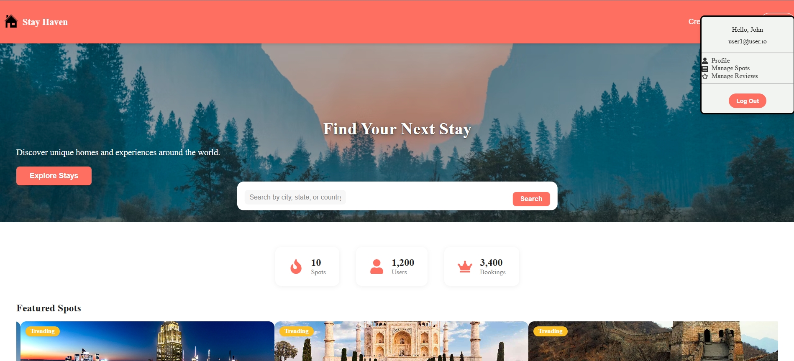
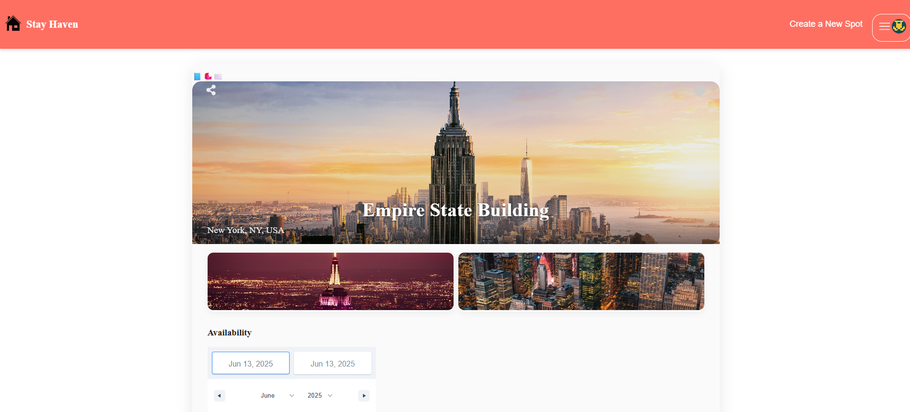

# StayHaven

[Live Site](https://stayhaven-hyyh.onrender.com)

StayHaven is a full-stack Airbnb-style booking platform where users can browse, book, and review unique stays around the world. Built with React, Redux, Express, Sequelize, and PostgreSQL.

---

## Table of Contents

-   [Features](#features)
-   [Screenshots](#screenshots)
-   [Tech Stack](#tech-stack)
-   [Getting Started](#getting-started)
    -   [Prerequisites](#prerequisites)
    -   [Installation](#installation)
    -   [Environment Variables](#environment-variables)
    -   [Database Setup](#database-setup)
    -   [Running the App](#running-the-app)
-   [Project Structure](#project-structure)
-   [API Documentation](#api-documentation)
-   [Database Schema](#database-schema)
-   [Contributing](#contributing)
-   [Contact](#contact)

---

## Features

-   User authentication (sign up, login, logout)
-   Browse and search spots with filters
-   View detailed spot pages with image galleries and maps
-   Book spots with date selection and availability calendar
-   Leave reviews and ratings for spots
-   Manage your own spots, bookings, and reviews
-   Wishlist spots for future reference
-   Responsive and accessible UI

---

## Screenshots


[]
[]

[]
[]


---

## Tech Stack

-   **Frontend:** React, Redux, Vite, Framer Motion, React Date Range, Google Maps API
-   **Backend:** Node.js, Express, Sequelize, PostgreSQL
-   **Authentication:** JWT, bcrypt
-   **Deployment:** Render.com

---

## Getting Started

### Prerequisites

-   [Node.js](https://nodejs.org/) (v18+ recommended)
-   [npm](https://www.npmjs.com/)
-   [PostgreSQL](https://www.postgresql.org/)

### Installation

1. **Clone the repository:**

    ```sh
    git clone https://github.com/BMcCarthy96/StayHaven.git
    cd StayHaven
    ```

2. **Install dependencies:**
    ```sh
    npm install
    cd backend && npm install
    cd ../frontend && npm install
    ```

### Environment Variables

Create a `.env` file in the `backend/` directory with the following:

```
NODE_ENV=development
PORT=8000
JWT_SECRET=your_jwt_secret
JWT_EXPIRES_IN=604800
SCHEMA=dbSchema
DB_FILE=./db/dev.db
```

For production, configure your environment variables on Render or your hosting provider.

### Database Setup

1. **Create the database and schema:**

    ```sh
    createdb stayhaven_dev
    ```

2. **Run migrations and seeders:**
    ```sh
    npx sequelize-cli db:migrate
    npx sequelize-cli db:seed:all
    ```

### Running the App

**Development:**

-   **Backend:**
    ```sh
    cd backend
    npm start
    ```
-   **Frontend:**
    ```sh
    cd frontend
    npm run dev
    ```

**Production Build:**

-   Build frontend and serve with backend:
    ```sh
    cd frontend
    npm run build
    cd ../backend
    npm start
    ```

---

## Project Structure

```
StayHaven/
├── backend/
│   ├── app.js
│   ├── config/
│   ├── db/
│   │   ├── dev.db
│   │   ├── migrations/
│   │   ├── models/
│   │   └── seeders/
│   ├── routes/
│   ├── utils/
│   └── ...
├── frontend/
│   ├── src/
│   │   ├── components/
│   │   ├── context/
│   │   ├── store/
│   │   └── main.jsx
│   ├── public/
│   └── ...
├── images/
├── package.json
└── README.md
```

---

## API Documentation

See below for key endpoints. All endpoints return JSON.

### Authentication

-   `POST /api/session` — Log in
-   `DELETE /api/session` — Log out
-   `POST /api/users` — Sign up
-   `GET /api/session` — Get current user

### Spots

-   `GET /api/spots` — Get all spots (with filters)
-   `GET /api/spots/:spotId` — Get spot details
-   `POST /api/spots` — Create a spot
-   `PUT /api/spots/:spotId` — Edit a spot
-   `DELETE /api/spots/:spotId` — Delete a spot
-   `POST /api/spots/:spotId/images` — Add image to spot

### Bookings

-   `GET /api/bookings/current` — Get current user's bookings
-   `GET /api/spots/:spotId/bookings` — Get bookings for a spot
-   `POST /api/spots/:spotId/bookings` — Create a booking
-   `PUT /api/bookings/:bookingId` — Edit a booking
-   `DELETE /api/bookings/:bookingId` — Delete a booking

### Reviews

-   `GET /api/spots/:spotId/reviews` — Get reviews for a spot
-   `POST /api/spots/:spotId/reviews` — Create a review for a spot
-   `PUT /api/reviews/:reviewId` — Edit a review
-   `DELETE /api/reviews/:reviewId` — Delete a review
-   `POST /api/reviews/:reviewId/images` — Add image to a review

### Wishlists

-   `GET /api/wishlist` — Get user's wishlist
-   `POST /api/wishlist/:spotId` — Add spot to wishlist
-   `DELETE /api/wishlist/:spotId` — Remove spot from wishlist

**For detailed request/response examples, see the [full API documentation](#).**

---

## Database Schema


-   Users
-   Spots
-   Bookings
-   Reviews
-   SpotImages
-   ReviewImages
-   Wishlists

---

## Contributing

Contributions are welcome! Please open an issue or submit a pull request.

1. Fork the repo
2. Create your feature branch (`git checkout -b feature/YourFeature`)
3. Commit your changes (`git commit -am 'Add some feature'`)
4. Push to the branch (`git push origin feature/YourFeature`)
5. Open a pull request

## Contact

**Brandon McCarthy**
[GitHub](https://github.com/BMcCarthy96)
[LinkedIn](https://www.linkedin.com/in/brandon-mccarthy/)
Email: brandon.mccarthy96@gmail.com

---

\*\*Enjoy using StayHaven! If you like this project, please
